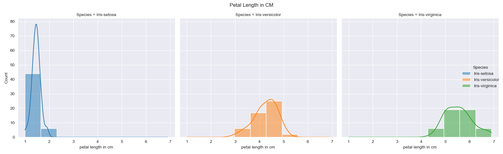
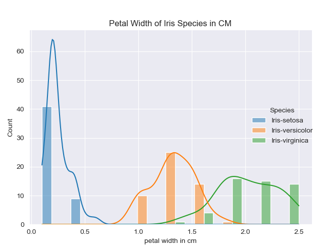
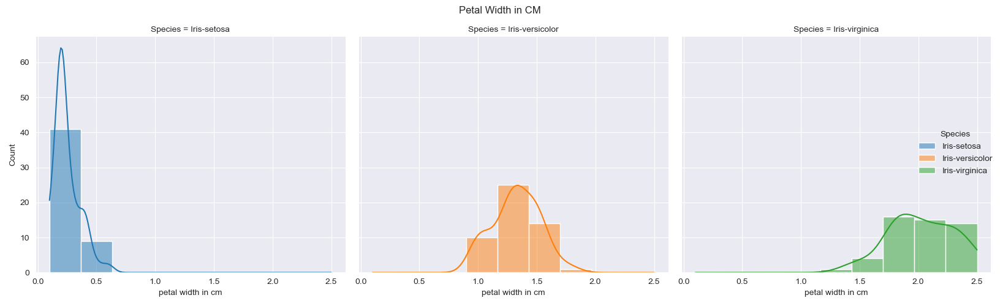
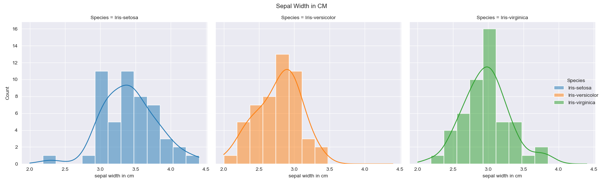
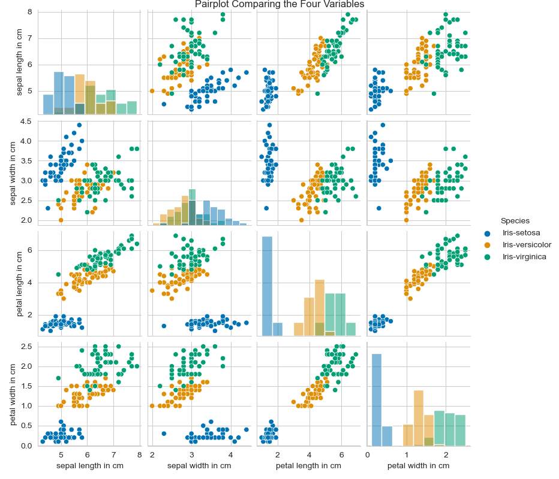
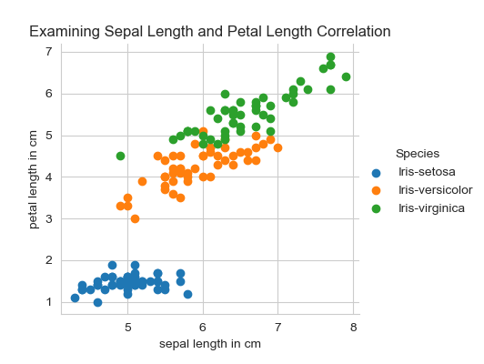
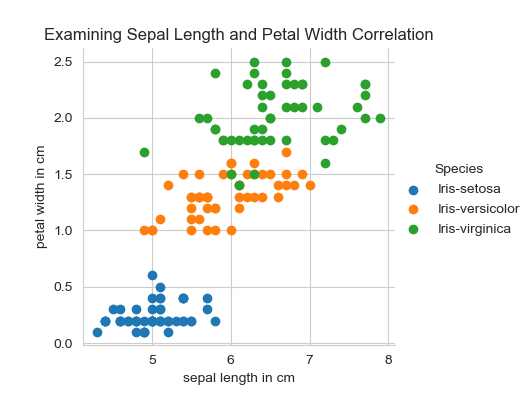

 # pands-project2021 
___
# Title: PANDS Project 2021 
# Author: Betty Attwood G00398300

___
## i. About the Project:
This project analyses the well-known Fisher’s Iris data set [1] using Python [2]. This repository documents the researching of the data set, the documentation, and the code (in Python) used to investigate it.  
This project forms part of the coursework required for the module Programming & Scripting, a core module of GMIT's Higher Diploma of Computer Science in Data Analytics.  

## ii. Project Plan

Break down Tasks based on Project Objectives:  

• outputs a summary of each variable to a single text file,  
• saves a histogram of each variable to png files, and  
• outputs a scatter plot of each pair of variables.    

First Consideration: Framework  

1. Set up basic python project that imports Fisher's Iris Data Set and import libraries needed
2. Figure out how to parse specific data from the data set
3. Select from data set information I want to document and compare  

Second Consideration: Logic  

1. Output a summary of each variable
2. Write to a text file
3. Get variable data for a histogram
4. Save histogram as png
5. Use variable data to create scatter plot of paired variables  

Third Consideration: Presentation  

1. Include in program documentation so anyone can run it and understand what it is doing. i.e any prompts or data shown is clearly defined
2. Include in code documentation of what each block of text does along with what imports it is dependent on.
3. Formatting of summary text files and images for the best experience of the end user.
4. Ensure README file is thorough and includes sources referenced in the completion of this project.

#  README Table of Contents  
i. About the Project  
ii. Project Plan  

1. Introduction   
2. Setting the Environment, Libraries and Modules  
  2.1 The Programming Environment  
  2.2 Obtaining the Data Set  
3. Analysing: Parsing the Data Set  
  3.1 Reading in the Data  
  3.2 Writing to a .txt File  
  3.3 Parsing the Data Set as a Whole  
  3.4 Drilling into the Data Set by Species type  
4. Visualising the Data Set
  4.1 Histograms  
  4.2 Box and Swarm Plots  
  4.3 Scatterplots  
5. Conclusion


# 1. Introduction - History & Significance of the Iris Data Set

Fisher's Iris data set is well known because it provides a manageably small but robust enough real world multivariagate data set [3]. This is ideal for use in a wide scope of problem solving scenarios including statistical analysis, statistical graphics, multivariate statistics and machine learning [4].  

Ronald Aylmer Fisher, later knighted for his work in statistics [3], wrote a paper in 1936 titled "The Use of Multiple Measurements in Taxonomic Problems" in which the Iris data set first appears [5]. The data set is a balanced data set consisting of 150 samples. It is considered a balanced dataset because it breaks down into 50 samples from each of three species of Iris (*Iris setosa, Iris versicolor, and Iris virginica*) [5].  Fisher's Iris data set is a multivariate data set containing four variable: sepal length and width, and petal length and width as well as the class (the three species of Iris). 

The data was used by Fisher with permission by Dr Edgar Anderson, who picked and measured two of the three species on the Gaspé Peninsula in Canada. The data Dr Anderson collected for each sample included sepal length in cm, sepal width in cm, petal length in cm, and petal width in cm [5]. In the article [5], Fisher developed and evaluated a linear function to differentiate between Iris species based on these four measurements [3]. 

   
Image Credit *Plural Sight* [6]

Fisher's Iris data set is an ideal starting point for learning data mining techniques. Data mining is digging through data to look for connections and predict trends. SAS notes data mining is a culmination of "three intertwined scientific disciplines: statistics (the numeric study of data relationships), artificial intelligence (human-like intelligence displayed by software and/or machines) and machine learning (algorithms that can learn from data to make predictions)" [7]. Machine Learning is a popular area of use as the data set is ideal for teaching beginners principles of machine learning as well as serving as an ideal test for new sorting and classifying methods. It is so commonly used that the machine learning library for Python Scikit-Learn (sk-learn) includes it as one of the loadable data sets. The data set is also freely available for download and use from UC Irvine's Machine Learning Repository [1]. UC Irvine's Machine Learning Repository enumerates the many published papers that reference this dataset showing the wide range of domains it is used in especially in the domains of computer science and statistics [1]. 

### References for Section 1:  

[1] UC Irvine Machine Learning Repository. Iris data set.
http://archive.ics.uci.edu/ml/datasets/Iris.  [Accessed 9 April 2021]  
[2] Python Software Foundation. Welcome to python.org. https://www.python.org/.  
[3] Cui, Y. (2020, April 25). "The Iris Dataset-A Little Bit of History and Biology." Towards Data Science. Available: https://towardsdatascience.com/the-iris-dataset-a-little-bit-of-history-and-biology-fb4812f5a7b5 [Accessed 17 April 2021]  
[4] Cox, N. (2013) "Aspects of the Iris data set". Stack Exchange. Available: https://stats.stackexchange.com/questions/74776/what-aspects-of-the-iris-data-set-make-it-so-successful-as-an-example-teaching [Accessed 17 April 2021]   
[5] Fisher, R.A. (1936), The Use of Multiple Measurements in Taxonomic Problems. *Annals of Eugenics*, 7: 179-188. Available: https://doi.org/10.1111/j.1469-1809.1936.tb02137.x [Accessed 17 April 2021]
[6] Singhal, G. (2020) *Plural Sight* "Designing a Machine Learning Model" Available: https://www.pluralsight.com/guides/designing-a-machine-learning-model [Accessed 17 April 2021]
[7] SAS. (2021). 'What is Data Mining?' Available: https://www.sas.com/en_ie/insights/analytics/data-mining.html [Accessed 17 April 2021]

# 2 Setting Up the Environment, & Libraries & Modules 

## 2.1 The Programming Environment

I completed the project using Python 3.8.5 via Conda 4.9.2.  
Tasks were run through the code editor VS Code Version 1.55.0.  
All the code and documentation is stored publically on my GitHub repository.  
Various libraries were imported for this project:

1. pandas
2. numpy
3. matplotlib
4. seaborn

These libraries were imported using the follow code:  

    import pandas as pd
    import numpy as np
    import matplotlib.pyplot as plt
    import seaborn as sns

The as combined with import allows the module to be renamed for ease of use in the coding [7].  

Informatiom about the libraries imported and their relevance to the project:  


- **pandas**: Pandas is a library specifically for working with data sets. It helps with analyzing, cleaning, exploring, and manipulating data [3].   

- **numpy**: NumPy stands for numberical Python and is particularly useful as its `nparray` feature allows for speed in dealing with arrays. [2]  

- **matplotlib**: MatPlotLib is a low level graph plotting function that allows for visualisation of data in plot format. Many of the most useful functions are under the submodule `pyplot` often downloaded as `plt`  [4]
    import matplotlib.pyplot as plt  
This library is useful for making some of the simpler plots to illustrate the dataset and seaborn is a library which build upon it.   

- **seaborn**: Seaborn library works with matplotlib and its strengths lay in visualising random distributions [5].  


### References for Part 2.1:

[1] AskPython.com "How to Read a .data file?"  Available: https://www.askpython.com/python/examples/read-data-files-in-python [Accessed 18 April 2021]   
[2] w3schools.com "NumPy Introduction" Available: https://www.w3schools.com/python/numpy/numpy_intro.asp [Accessed 18 April 2021].     
[3] w3schools.com "Pandas Introduction" Available: https://www.w3schools.com/python/pandas/pandas_intro.asp  [Accessed 18 April 2021].    
[4] w3schools.com "Matplotlib Introduction" Available: https://www.w3schools.com/python/matplotlib_intro.asp [Accessed 18 April 2021].    
[5] w3schools.com "Seaborn Module" Available: https://www.w3schools.com/python/numpy/numpy_random_seaborn.asp [Accessed 18 April 2021].   
[6] Scikit-learn.org "Scikit=Learn Tutorial" Available: https://scikit-learn.org/stable/tutorial/basic/tutorial.html [Accessed 18 April 2021].  
[7] stackabuse.com "Relative vs Absolute Imports in Python" Available: https://stackabuse.com/relative-vs-absolute-imports-in-python/ [Accessed 27 April 2021]

## 2.2 Obtaining the Data Set  

## 2.2.1 Downloading the Dataset

Before beginning the analysis, the data set had to be downloaded. It is available from UCI Machine Learning Repository or can be loaded in Pythopn using sk-learn. As the dataset is requested to be uploaded to the repository I downloaded the file from UCI Machine Learning Database as a .data file. These .data files hold data in either comma seperated value (.csv) format or in tab seperated value format and the data may be in text or binary format [1]. The iris.data file opened in VS Code in csv format and was in text.  

Once the libraries have been added and the data set downnloaded from UCI's Machine Learning Repository,
the next step is to save the UCI `.data` file into my repository folder and to read it into my ``analysis.py`` file.  

## 2.2.2 Importing the Data Set
There are several methods for opening the Iris data set in a Python program that I encountered while researching. I chose to import pandas as `pd` and use the read in function [1] as the  iris.data file is structured in a csv format [4]: `pd.read_csv()`.  
I chose this method because it is straightforward and the pandas module is a foundational library for data analysis. Other options for importing including using JSON or pickle [4], but the pandas method seemed sufficient for this task. Also, pandas did not involve the more complicated capabilities of scikit-learn which might not be necessary at the beginner level[2] or the extra conversion steps of shutil and loss of metadata [3] which were other options for completing this task. 

### Referenences for Part 2.2  

[1] w3schools.com "Pandas Tutorial" Available: https://www.w3schools.com/python/pandas/pandas_csv.asp [Accessed 19 April 2021]  
[2] Scikit-Learn.org "Loading Iris Data Set" Available: https://scikit-learn.org/stable/modules/generated/sklearn.datasets.load_iris.html [Accessed 19 April 2021].    
[3] Python Docs. "Shutil- High Level File Operations"Available: https://docs.python.org/3/library/shutil.html [Accessed 19 April 2021].    
[4]  AskPython.com "How to Read a .data file?"  Available: https://www.askpython.com/python/examples/read-data-files-in-python [Accessed 18 April 2021].  


# 3 Analysing: Parsing the dataset  

## 3.1 Reading in the Data  

The csv dataset read in from the `.data` file is named as a variable, irisData, and then I created a dataframe, df, for it [4] The dataframe allows for two dimensional labeled data structures with columns of potentially different types [5].:  
``irisData = pd.read_csv('iris.data', names =["sepal length in cm", "sepal width in cm", "petal length in cm", "petal width in cm", "Species"])`` 
  

## 3.2 Writing to a .txt File  

One of the primary objectives of the project is to analyse the data using python and to generate a summary of the data in `.txt` file format. I used the `with open()` method of populating my data to a .txt file [1]. This method was chosen because it will automatically close the file once I leave the block [2].   

The code used is: 
`with open("iris_summary.txt", "w") as f:`  
The write ("w) option was chosen as I want the program to create the file if it does not already exist and write over it each time the program is ran [3]. This is important because if changes are made to the dataset, the information in the `.txt` file will be automatically updated when the program runs with the new data.  

## 3.3 Parsing the Dataset as a whole 

**Code block of the summary of the dataset as a whole**:  
 This will be broken down as I walk through the code below the code block.  

        # Basic investigation into the dataset:
        f.write("Object Type for iris Data:\n\n" + str(type(irisData)) + "\n\n\n")
        f.write("This shows the basic info of the data set.\nIt includes a sampling of the head and tail of the data, the index and the number of rows and columns.\n\n" + str(irisData.info) + "\n\n\n")
        irisShape = irisData.shape # this gives me the shape of the matrix or data table - 150 rows, five columns
        f.write("Data Table Shape; The number of rows and number of columns:\n\n " + str(irisShape) + "\n\n\n")
        f.write("The Index of the columns are provided below along with the datatype:\n\n" + str(irisData.columns) + "\n\n\n") # this prints the Index showing titles of the columns)
        descriptives = irisData.describe()
        f.write("Table Summary of the Statistics of the Data Set Variables:\n\n" + descriptives.to_string() + "\n\n\n")
        f.write("The Iris data set is a balaced data set.\nBreakdown of the data by species:\n\n" + str(irisData["Species"].value_counts()) 
        + "\n\n\n")    

The various elements of analysis were wrapped in `f.write()` to have the resulting analysis automatically written to the .txt file.  

`f.write("This file contains basic data regarding the file type and contents of Fisher's Iris Data Set.\n\n\n")`  

Then the basic analysis comprised of running several in-built pandas functions including:
- ``type()`` returning the type of the specified object [6]  
  returns: `<class 'pandas.core.frame.DataFrame'>`
-  ``.info`` [7] provides a concise summary of the dataframe.  
 returns:  
```` <bound method DataFrame.info of      sepal length in cm  sepal width in cm  petal length in cm  petal width in cm         Species
0                   5.1                3.5                 1.4                0.2     Iris-setosa
1                   4.9                3.0                 1.4                0.2     Iris-setosa
2                   4.7                3.2                 1.3                0.2     Iris-setosa
3                   4.6                3.1                 1.5                0.2     Iris-setosa
4                   5.0                3.6                 1.4                0.2     Iris-setosa
..                  ...                ...                 ...                ...             ...
145                 6.7                3.0                 5.2                2.3  Iris-virginica
146                 6.3                2.5                 5.0                1.9  Iris-virginica
147                 6.5                3.0                 5.2                2.0  Iris-virginica
148                 6.2                3.4                 5.4                2.3  Iris-virginica
149                 5.9                3.0                 5.1                1.8  Iris-virginica

[150 rows x 5 columns]>
````

-  `.shape`   provides a tuple of the dimensions of the dataframe.[8]  
  returns:  ``(150, 5)``

- `.columns` returns the index of the columns along with the data type.
returns: 
``Index(['sepal length in cm', 'sepal width in cm', 'petal length in cm', 'petal width in cm', 'Species'],dtype='object')``  

-  `.describe` provides a summary of statistics about the data frame columns including mean, sample standard deviation, and interquartile range [9].  
returns:  

````sepal length in cm  sepal width in cm  petal length in cm  petal width in cm
count          150.000000         150.000000          150.000000         150.000000
mean             5.843333           3.054000            3.758667           1.198667
std              0.828066           0.433594            1.764420           0.763161
min              4.300000           2.000000            1.000000           0.100000
25%              5.100000           2.800000            1.600000           0.300000
50%              5.800000           3.000000            4.350000           1.300000
75%              6.400000           3.300000            5.100000           1.800000
max              7.900000           4.400000            6.900000           2.500000 
````  

-  `.value_counts()`.  returns a series the counts of unique rows in the dataframe [10].  
returns:  
``Iris-setosa        50
Iris-virginica     50
Iris-versicolor    50
Name: Species, dtype: int64``

  

Issues encountered: 
for ``.info`` getting:    ``<bound dataframe.info issue``
look at the <bound dataframe.info issue later -- https://stackoverflow.com/questions/46239946/attempt-to-access-dataframe-column-displays-bound-method-ndframe-xxx
https://www.reddit.com/r/learnprogramming/comments/3yx9er/python_what_does_it_mean_to_call_something/
        Also key: https://pandas.pydata.org/pandas-docs/version/0.25.3/reference/api/pandas.DataFrame.info.html
 Issues with reading in -- tried .df and didnt work -- tried without and got errors but solved with using str to convert tuples into writeable format. Add step by step instructions here. shape - w3schools.com "Numpy Array Shape" Available: https://www.w3schools.com/python/numpy/numpy_array_shape.asp [Accessed 19 April 2021]. Pandas Dataframe.info would not print to the doc pandas.pydata.org "Pandas DataFrame.Info" Available: https://pandas.pydata.org/docs/reference/api/pandas.DataFrame.info.html [Accessed 19 April 2021].  learndatasci.org Pandas Python Tutorial Available: https://www.learndatasci.com/tutorials/python-pandas-tutorial-complete-introduction-for-beginners/  [Accessed 19 April 2021]. 

## 3.4 Drilling into the Data - Parsing by Species of Iris  

More meaningful data could be obtained by using either the groupby() functions of pandas or converting the dataframe into a pivot table to isolate the three species types and look at the statistical information for each of them. 

Code Block:  
  ``f.write("Digging Deeper into the Data - Examining by Species\n\n\n\n")   
f.write("Pivot Table Showing Each Species Mean Measurements: \n\n" + str(irisData.pivot_table(index='Species', values=["sepal length in cm", "sepal width in cm", "petal length in cm", "petal width in cm"], aggfunc=np.mean)) + "\n\n")  
f.write("Pivot Table Showing Each Species Median Measurements: \n\n" + str(irisData.pivot_table(index='Species', values=["sepal length in cm", "sepal width in cm", "petal length in cm", "petal width in cm"], aggfunc=np.median)) + "\n\n")  
f.write("Pivot Table Showing Each Species Max Measurements: \n\n" + str(irisData.pivot_table(index='Species', values=["sepal length in cm", "sepal width in cm", "petal length in cm", "petal width in cm"], aggfunc=np.max)) + "\n\n")  
f.write("Pivot Table Showing Each Species Min Measurements: \n\n" + str(irisData.pivot_table(index='Species', values=["sepal length in cm", "sepal width in cm", "petal length in cm", "petal width in cm"], aggfunc=np.min)) + "\n\n")``  

**Breakdown of the code**:  

The Pivot Table Method:  

The pandas .pivot_table method allows for data digging by creating multiindex objects and allowing selective summaries of the table [11]. Here I chose 'Series' as the index and investigated this for the values of sepal lenth, sepal width, petal length, and petal width.  

`(irisData.pivot_table(index='Species', values=["sepal length in cm", "sepal width in cm", "petal length in cm", "petal width in cm"], aggfunc=np.mean))`  

results: 

Pivot Table Showing Each Species Mean Measurements:  

                         petal length in cm  petal width in cm  sepal length in cm  sepal width in cm 
    Species                                                                                        
    Iris-setosa                   1.464              0.244               5.006              3.418 
    Iris-versicolor               4.260              1.326               5.936              2.770 
    Iris-virginica                5.552              2.026               6.588              2.974  
  
**Observations**: This table shows that there is a significant difference between the mean petal lenth in cm of the *Iris setosa* from the other two species *Iris versicolor* and *Iris virginica*. The mean petal length for *Iris setosa* is significantly smaller than the other species and the mean petal width for *Iris setosa*  is somewhat smaller as well, although the range of difference is less than compairing petal length. There is very low range of variation between the species when comparing mean sepal length and width. 

Pivot Table Showing Each Species Median Measurements: 

                    petal length in cm  petal width in cm  sepal length in cm  sepal width in cm
    Species                                                                                      
    Iris-setosa                    1.50                0.2                 5.0                3.4
    Iris-versicolor                4.35                1.3                 5.9                2.8
    Iris-virginica                 5.55                2.0                 6.5                3.0  

**Observations**: This table shows that there is a significant difference between the median petal lenth in cm of the *Iris setosa* from the other two species *Iris versicolor* and *Iris virginica*. The median petal length for *Iris setosa* is significantly smaller than the other species and the median petal width for *Iris setosa*  is somewhat smaller as well, although the range of difference is less than compairing petal length. There is very little variation between the species when comparing median sepal length and width. However, the median sepal length of *Iris setosa* is still slightly smaller than the other two. The sepal width does not appear to be a good indicator of differences between the species.


Pivot Table Showing Each Species Maximum Measurements: 

                    petal length in cm  petal width in cm  sepal length in cm  sepal width in cm
    Species                                                                                      
    Iris-setosa                     1.9                0.6                 5.8                4.4
    Iris-versicolor                 5.1                1.8                 7.0                3.4
    Iris-virginica                  6.9                2.5                 7.9                3.8  

**Observations**: This table shows that there is a significant difference between the maximum petal lenth in cm of the *Iris setosa* from the other two species *Iris versicolor* and *Iris virginica*. The maximum petal length for *Iris setosa* is significantly smaller than the other species and the maximum petal width for *Iris setosa*  is somewhat smaller as well. There is less variation between the species when comparing sepal length and width. However, the maximum sepal length of *Iris setosa* is still noteworthy. The maximum sepal width shows the least range of difference between the species.  


Pivot Table Showing Each Species Minimum Measurements: 

                    petal length in cm  petal width in cm  sepal length in cm  sepal width in cm
    Species                                                                                      
    Iris-setosa                     1.0                0.1                 4.3                2.3
    Iris-versicolor                 3.0                1.0                 4.9                2.0
    Iris-virginica                  4.5                1.4                 4.9                2.2  

**Observations**: This table shows that there is a significant difference between the minimum petal lenth in cm of the *Iris setosa* from the other two species *Iris versicolor* and *Iris virginica*. The minimum petal length for *Iris setosa* is significantly smaller than the other species and the minimum petal width for *Iris setosa*  is somewhat smaller as well, although the range of difference is less than compairing petal length. There is very little variation between the species when comparing minimum sepal length and width. However, the minimum sepal length of *Iris setosa* is still slightly smaller than the other two. The sepal width shows no significant range of difference between the species.

The Alternative groupby() Method:
**Code Block**:
f.write("Maximum values for each attribute by Species: \n\n" + str(irisData.groupby('Species').max()) +"\n\n")  
f.write("Minimum values for each attribute by Species: \n\n" + str(irisData.groupby('Species').min()) +"\n\n")  
f.write("Median values for each attribute by Species: \n\n" + str(irisData.groupby('Species').median()) +"\n\n")

**Code Walk Through:**

`str(irisData.groupby('Species').max())` and ``.min()``, ``.median()``. The groupby() function with dataframes allows grouping by an object, in this case the variable 'Species' and the ``.agg`` function is used to return a single aggregated value for each group (such as max, min, median) [11]. 

returns: 

    Maximum values for each attribute by Species:
                    sepal length in cm  sepal width in cm  petal length in cm  petal width in cm
    Species                                                                                      
    Iris-setosa                     5.8                4.4                 1.9                0.6
    Iris-versicolor                 7.0                3.4                 5.1                1.8
    Iris-virginica                  7.9                3.8                 6.9                2.5  


**Observations**: This table shows that there is a significant difference between the maximum petal lenth in cm of the *Iris setosa* from the other two species *Iris versicolor* and *Iris virginica*. The maximum petal length for *Iris setosa* is significantly smaller than the other species and the maximum petal width for *Iris setosa*  is somewhat smaller as well. There is less variation between the species when comparing sepal length and width. However, the maximum sepal length of *Iris setosa* is still noteworthy. The maximum sepal width shows the least range of difference between the species.

    Minimum values for each attribute by Species: 

                     sepal length in cm  sepal width in cm  petal length in cm  petal width in cm
    Species                                                                                      
    Iris-setosa                     4.3                2.3                 1.0                0.1
    Iris-versicolor                 4.9                2.0                 3.0                1.0
    Iris-virginica                  4.9                2.2                 4.5                1.4  

**Observations**: This table shows that there is a significant difference between the minimum petal lenth in cm of the *Iris setosa* from the other two species *Iris versicolor* and *Iris virginica*. The minimum petal length for *Iris setosa* is significantly smaller than the other species and the minimum petal width for *Iris setosa*  is somewhat smaller as well, although the range of difference is less than compairing petal length. There is very little variation between the species when comparing minimum sepal length and width. However, the minimum sepal length of *Iris setosa* is still slightly smaller than the other two. The sepal width shows no significant range of difference between the species.

    Median values for each attribute by Species: 

                     sepal length in cm  sepal width in cm  petal length in cm  petal width in cm
    Species                                                                                      
    Iris-setosa                     5.0                3.4                1.50                0.2
    Iris-versicolor                 5.9                2.8                4.35                1.3
    Iris-virginica                  6.5                3.0                5.55                2.0  

**Observations**: This table shows that there is a significant difference between the median petal lenth in cm of the *Iris setosa* from the other two species *Iris versicolor* and *Iris virginica*. The median petal length for *Iris setosa* is significantly smaller than the other species and the median petal width for *Iris setosa*  is somewhat smaller as well, although the range of difference is less than compairing petal length. There is very little variation between the species when comparing median sepal length and width. However, the median sepal length of *Iris setosa* is still slightly smaller than the other two. The sepal width does not appear to be a good indicator of differences between the species.


### References for Section 3

[1] RealPython.com "Python With Open As Pattern" Available: https://realpython.com/working-with-files-in-python/#pythons-with-open-as-pattern  [Accessed 19 April 2021].      
[2] Mertz, J. RealPython.com "Reading and Writing Files in Python (Guide)" Available: https://realpython.com/read-write-files-python/  [Accessed 19 April 2021].  
[3] w3schools.com. "Python File Write" Available: https://www.w3schools.com/python/python_file_write.asp [Accessed 19 April 2021].  
[4] w3resource.com "Pandas DataFrame: to_string() function" Available: https://www.w3resource.com/pandas/dataframe/dataframe-to_string.php [Accessed 19 April 2021].  
[5] Datacamp. "Pandas Tutorial: DataFrames in Python" Available: https://www.datacamp.com/community/tutorials/pandas-tutorial-dataframe-python [Accessed 19 April 2021].  
[6] w3schools.com "Python Type() Function" Available: https://www.w3schools.com/python/ref_func_type.asp [Accessed 20 April 2021].
[7] w3resources.com "Pandas DataFrame .info Function" Available: https://www.w3resource.com/pandas/dataframe/dataframe-info.php [Accessed 20 April 2021].
[8] w3resource.com "Pandas Dataframe Property:Shape" Available: https://www.w3resource.com/pandas/dataframe/dataframe-shape.php [Accessed 20 April 2021].
[9] tutorialspoint.com "Python Pandas Descriptive Statistics" Available: tutorialspoint.com/python_pandas/python_pandas_descriptive_statistics.htm [Accessed 20 April 2021].
[10] pandas.pydata.org "Pandas .DataFrame.value_counts" Available: https://pandas.pydata.org/docs/reference/api/pandas.DataFrame.value_counts.html [Accessed 20 April 2021].
[11] pydata.org "Pandas pivot_table" Available: https://pandas.pydata.org/docs/reference/api/pandas.pivot_table.html [Accessed 21 April 2021].

# 4 Visualising the Data
I chose to use the Python library Seaborn which builds upon Matplotlib to create high quality statistical graphics [1]. 
Seaborn.pydata.org has extensive information on how to create plots to show relational, distributional, categorical, and regression with customisation of plot types, layout and colour and grid options.

# 4.1.1 Histograms of the Variables

The first step is to create histograms of the variables (sepal length, sepal width, petal length, petal width).
``sns.displot`` the first step is to call seaborn and specify plot chosen as histogram ``.displot()``. 


Then we define the parameters of the histplot ``(irisData, x = "sepal length in cm", hue="Species", kde=True, binwidth=0.2)``  

Parameters explained:

Firstly it specifies the data it is to use is my dataset irisData, the x axis indicates we are looking at the sepal length in cm, the y is by default set to count, the hue specifies which columns in the data seaborn uses to set its color encoding, I have set it to colour code by Species [1].  

The kde option stands for kernel density estimate. "Rather than using discrete bins, a KDE plot smooths the observations with a Gaussian kernel, producing a continuous density estimate" [2] By plotting this you can visualize the distribution of observartions in a dataset analagous to a histogram [3].  

The bin is when the entire range of values is divided into a series of intervals so that it can be counted how many values fall into each interval[4]. The bars on the histogram are called bins. By default the number of bins assigned based on the amount of variables but can be adjusted. The height of each bin shows how many values from the data fall into that range [5]. The width of each bin is equal to the (max value of data – min value of data) / total number of bins.  

Since there are multiple variables we are looking at, ``multiple="dodge"`` is used to display them more clearly in the histographs that contain data regarding all three species of Iris [6]. Other options were using a "layer" or "step" approach but in this case the dodge made it easiest to see the counts of measurements the distinctive Iris types.

``plt.grid()`` A grid is used to make understanding the data easier. 

``plt.savefig('Histogram_All_SepalLength.png')`` Matplotlib Pyplot has an option to save plots into a image file such as a png. [7] This saves to the current working directory.
``plt.clf()`` This clears the current figure from the code so that it does not add all the plots to one file [8]

This process is repeated for sepal width, petal length, petal width.  

Code block:  
    \# Histograms of the variables

    #sepal length
    sns.set_style("darkgrid")
    sns.displot(irisData, x = "sepal length in cm", hue="Species", kde=True, multiple="dodge") # hue color codes by that variable
    \# dodge makes the different species easier to see # kde adds a kernal density estimator line to the plot
    \# Saves the plot as a png image
    plt.savefig('Histogram_All_SepalLength.png')
    plt.show() # Clears the plot so a new plot can be created. Without this, the subsequent plots are combined into the previous plot

    sns.set_style("darkgrid")
    sns.displot(data=irisData, x="sepal length in cm", hue="Species", col="Species", kde=True)  
    plt.savefig('Histogram_Individual_SepalLength.png')
    plt.show() 

    \# sepal width
    sns.set_style("darkgrid")
    sns.displot(irisData, x = "sepal width in cm", hue="Species", kde=True, multiple="dodge") # hue color codes by that variable
    \# dodge makes the different species easier to see # kde adds a kernal density estimator line to the plot
    \# Saves the plot as a png image
    plt.savefig('Histogram_All_SepalWidth.png')
    plt.show() # Clears the plot so further plots can be created.

    sns.set_style("darkgrid")
    sns.displot(data=irisData, x="sepal width in cm", hue="Species", col="Species", kde=True)  
    plt.savefig('Histogram_Individual_SepalWidth.png')
    plt.show() 

    \# petal length
    sns.set_style("darkgrid")
    sns.displot(irisData, x = "petal length in cm", hue="Species", kde=True, multiple="dodge") # hue color codes by that variable
    \# dodge makes the different species easier to see # kde adds a kernal density estimator line to the plot
    \# Saves the plot as a png image
    plt.savefig('Histogram_All_PetalLength.png')
    plt.show() # Clears the plot so further plots can be created.

    sns.set_style("darkgrid")
    sns.displot(data=irisData, x="petal length in cm", hue="Species", col="Species", kde=True)  
    plt.savefig('Histogram_Individual_PetalLength.png')
    plt.show() 

    \# petal width
    sns.set_style("darkgrid")
    sns.displot(irisData, x = "petal width in cm", hue="Species", kde=True, multiple="dodge") # hue color codes by that variable
    \# dodge makes the different species easier to see # kde adds a kernal density estimator line to the plot
    \# Saves the plot as a png image
    plt.savefig('Histogram_All_PetalWidth.png')
    plt.show() # Clears the plot so further plots can be created. 

    sns.set_style("darkgrid")
    sns.displot(data=irisData, x="petal width in cm", hue="Species", col="Species", kde=True)  
    plt.savefig('Histogram_Individual_PetalWidth.png')
    plt.show()


## 4.1.2 Analysis of Histograms

  



**Observations based on Histogram Plots of Petal Length**:  
Looking at the histogram of the three species types together, it is clear that *Iris setosa's* petal length are significantly shorter than the other two species. *Iris versicolor* and *Iris virginica* have a wider range of petal length and both have significantly longer petals than *Iris versicolor*. It is also clear that  there is some overlap in length between the *Iris versicolor* and *Iris virginica*, especially in the observations fallings into the greater than 4cm and less than 6cm.  
Looking at the individual histograms of each species it is clear that *Iris virginica* has a small range of petal lengths (visually approximate to 1cm-2cm range). *Iris versicolor* has a wider range with observations mostly falling between 3-5cms petal length. *Iris virginica* also has a broader range with most observations falling into the 4-7cm range of petal length. These plots indicate that Petal length might be a good method of seperating out *Iris setosa* from the others, but petal length alone does not seem to be sufficient for identifying the other two due to some overlap.


  

**Observations based on Plots of Petal Width**:
Looking at the histogram of the three species types together, it is clear that observations of *Iris setosa's* petal width are significantly shorter than the other two species. *Iris versicolor* and *Iris virginica* have a slightly wider range of petal width and both have wider petals than *Iris versicolor*. It is also clear that there is some overlap in width between the *Iris versicolor* and *Iris virginica*, especially in the observations fallings between the 1 and 2 cm range.  

Looking at the individual histograms of each species it is clear that *Iris virginica* has a small range of petal widths (visually approximate to just more than 0cm up to 0.5cm range). *Iris versicolor* has a wider range with a visual approximation based on the plot of observations mostly falling between 1-2cms petal width. *Iris virginica* also has a broader range with most observations appearing to falling into the 1.5-2.5cm range of petal width. These plots indicate that Petal width might be a good method of seperating out *Iris setosa* from the others, but petal width alone does not seem to be sufficient for identifying the other two due to some overlap.


**Observations based on Plots of Sepal Length**:
A cursory glance at the histogram of all of the species together shows that there is overlap between all three species when observing their sepal lengths. This indicated that it would not be the best variable to be used to identify species. Looking at the individual histograms does show some interesting observations such as *Iris setosa's* sepal length is generally smaller than the other two. It also shows *Iris virginica* has a broad range of observations of sepal length ranging from approximately 5-8cms in length.




**Observations based on Plots of Sepal Width**:  
Examing the histogram of all the species plotted on one histogram it is interested to note this variable has the most overlap. It also is the only variable that *Iris setosa* has some instances of observations larger than the other two species. However, looking at the KDE and the counts, it is clear that there are only a few such occurances and the majority of the observation points for all three species overlap on the variable of sepal width. This variable alone would not be helpful for useful to identify species.


### References 4.1 

[1] seaborn.pydata.org "Seaborn Introduction" Available: https://seaborn.pydata.org/#:~:text=Seaborn%20is%20a%20Python%20data,attractive%20and%20informative%20statistical%20graphics. [Accessed 22 April 2021].  
[2] seaborn.pydata.org "Seaborn Tutorial: KDE plots" Available: https://seaborn.pydata.org/tutorial/distributions.html#tutorial-kde [Accessed 22 April 2021].  
[3] seaborn.pydata.org "KDE Plots" Available: https://seaborn.pydata.org/generated/seaborn.kdeplot.html [Accessed 22 April 2021].  
[4]. Datacamp. "Histograms in Matplotlib" Available: https://www.datacamp.com/community/tutorials/histograms-matplotlib [Accessed 22 April 2021].  
[5] geeksforgeeks.org "Bin Size in MatPlotLib Histogram" Available: https://www.geeksforgeeks.org/bin-size-in-matplotlib-histogram/#:~:text=Width%20of%20each%20bin%20is,pyplot. [Accseed 22 April 2021].
[6] seaborn.pydata.org "Seaborn Distrubution Tutorial" Available: https://seaborn.pydata.org/tutorial/distributions.html [Accessed 22 April 2021].
[7] Matplotlib.org "Pyplot Savefig" Available: https://matplotlib.org/stable/api/_as_gen/matplotlib.pyplot.savefig.html [Accessed 22 April 2021]
[8] Matplotlib.org "Pyplot.clf" Available: https://matplotlib.org/stable/api/_as_gen/matplotlib.pyplot.clf.html [Accessed 22 April 2021].

# 4.2 Making Boxplots:  
A box plot is useful in explanatory data analysis. It helps summarise the dataset and show the distribution and can be particularly helpful in pointing out if there are outliers to the dataset which might through off some of the analysis [1]. Knowing whether there are outliers is important if this analysis might later be used to create machine learning algorithms. This program does not go into that area of exploration, but just wanted to note the occurances of outliers.  I overlayed the boxplots with a swarmplot which is like a strip plot, but with the points displayed vertically rather than on top of each other [3] for a more accurate picture of the occurances of observations and to emphasize outliers.

**Walkthrough of a sample portion of the code**:  

I chose to use a set of boxplots to plot the four variables and add a swarmplot overlay to emphasize the outliers.  

``figboxswarmplot, (ax1, ax2, ax3, ax4)`` names the fig we are creating and unpacks the dedicated variables for each Axes.
``= plt.subplots(1,4, figsize=(14,12)) ``sets the number of rows and columns and the size of the total figure [4].  

The x axis on all plots is Species ``sns.boxplot(x='Species',y='sepal length in cm',data=irisData, ax=ax1)``  
The y axis is a different variable per subplot and each one specifies which subplot axis it should be plotted to. 
``sns.swarmplot(x="Species", y="sepal length in cm", data=irisData, color="brown", ax=ax1)``  A seaborn swarmplot is called to map the same information on top of the boxplot in the color brown to stand out from the boxplot colors and better show outliers.
I borrowed the idea of overlaying the boxplot with a swarmplot from Binu's code on Kaggle [4].

Finally, I added labels to the axis (except when the axis lay inbetween plots) ``ax1.set_ylabel("Lenght/Width in cm")`` 
ax1.set_xlabel("Sepal Lenght in cm")  

**Full code block**: 

    figboxplot, (ax1, ax2, ax3, ax4) = plt.subplots(1,4, figsize=(14,12)) 
    sns.boxplot(x='Species',y='sepal length in cm',data=irisData, ax=ax1) # x axis on all plots is Species, 
    sns.swarmplot(x="Species", y="sepal length in cm", data=irisData, color="brown", ax=ax1) 
    ax1.set_ylabel("Lenght/Width in cm") #labeling the axis
    ax1.set_xlabel("Sepal Lenght in cm")

    sns.boxplot(x='Species',y='sepal width in cm',data=irisData, ax=ax2)
    sns.swarmplot(x="Species", y="sepal width in cm", data=irisData, color="brown", ax=ax2)
    ax1.set_ylabel("") # no label as this lays in the middle of the figure
    ax1.set_xlabel("Sepal Width in cm")

    sns.boxplot(x='Species',y='petal length in cm',data=irisData, ax=ax3)
    sns.swarmplot(x="Species", y="petal length in cm", data=irisData, color="brown", ax=ax3)
    ax1.set_ylabel("")
    ax1.set_xlabel("Petal Length in cm")

    sns.boxplot(x='Species',y='petal width in cm',data=irisData, ax=ax4)
    sns.swarmplot(x="Species", y="petal width in cm", data=irisData, color="brown", ax=ax4)
    ax1.set_ylabel("")
    ax1.set_xlabel("Petal Width in cm")
    plt.savefig("IrisBoxplots.png")
    plt.show()

**Output and Observations**:


The box and swarm plots show there are a few outliers from the data.  
There is an outlier in *Iris virginica* with one observation of sepal width much smaller than the rest of the species.  
*Iris virginica* also has some larger and smaller outliers for petal length.
*Iris versicolor* and *Iris setosa* have some outliers for petal width.  
*Iris setosa* also has two outliers of sepal length that are bigger than the rest of the observations.
The swarm plot overlay is also helpful for seeing when there is a clustering of observations versus a broad spread through the ranges.  


### 4.2 References:  
[1] stasticscanada.gc.ca "Constructing Box and Whiskerplots" Available: https://www150.statcan.gc.ca/n1/edu/power-pouvoir/ch12/5214889-eng.htm#:~:text=A%20box%20and%20whisker%20plot%20is%20a%20way%20of%20summarizing,central%20value%2C%20and%20its%20variability. [Accessed 27 April 2021].
[2] pythonbasics.org "Seaborn Boxplot Tutorial" Available: https://pythonbasics.org/seaborn-boxplot/ [Accessed 27 April 2021]
[3] Allen Yu, Claire Chung, Aldrin Yim "Strip Plots and Swarm Plots" in *Matplotlib 2.x By Example* O'Reilly Publishers. Available: https://www.oreilly.com/library/view/matplotlib-2x-by/9781788295260/f71c5b21-e7ea-447f-b898-0e38ba786ad7.xhtml [Accessed 29 April 2021].
[4] Binu. "Seaborn Matplotlib Iris Data Visualization Code_1" Available: https://www.kaggle.com/biphili/seaborn-matplotlib-iris-data-visualization-code-1 [Accessed 29 April 2021].
[5] Matplotlib.org "Creating Multiple Subplots using plt.subplot" Available: https://matplotlib.org/3.1.0/gallery/subplots_axes_and_figures/subplots_demo.html [Accessed 29 April 2021].

# 4.3 Making Scatterplots:  

Scatterplots can show the distribution of the four variable types color coded by the species type which is ideal for drawing conclusions about the dataset. This investigation looks at the six possible combinations of variable pairs:  

1. Sepal Length and Sepal Width
2. Sepal Length and Petal Length
3. Sepal Length and Petal Width
4. Sepal Width and Petal Length
5. Sepal Width and Petal Width
6. Petal Length and Petal Width

## 4.3.1 Pairplot
Seaborn has functionality called pairplot that allows for visualisation of multidimensional relationships in the data and generates plots of the multiple combinations of the paired data.
For the Iris Dataset a pair plot will look at the above six combinations of variables.  
It also looks at the mirrored versions of the above pairs.  
Finally, pairplots have four plots in the diagonal row can contain "a univariate distribution plot is drawn to show the marginal distribution of the data in each column" or can be modified to show a subset of variables or plot different variables on the rows and columns [1]. It is also possible to show a subset of variables or plot different variables on the rows and columns.  The code used was based on an example from the Python Data Science Handbook [6].

Code Block:

    sns.set_style("whitegrid")
    sns.pairplot(irisData, hue = "Species", diag_kind = "hist", palette = "colorblind", height = 2)
    plt.suptitle("Pairplot Comparing the Four Variables", y= 1.0001) #y = > 1 so the title appears slightly above the plot
    plt.savefig("pairplot.png")
    plt.show()  

 Code walkthrough:  

 `sns.set_style("whitegrid")` adds a grid to the plots and selects the style of it.  
 ``sns.pairplot`` calls seaborn's pairplot functionality.  
 Pairplot has many parameter options [1] but the most import ones are setting where the data comes from `(irisData, hue = "Species",` and setting the hue which determines what variable sets the color coding, in this case the Species. This allows for patterns to be easily seen within the different Iris species across the range of variables.  
 `diag_kind = "hist"` this set the diagonal row to show four histograms, one for each variable with the color coding to represent the Iris species.  
 `palette = "colorblind", height = 2)`For further customisation I set the color palette to "colorblind" for optimal accessibility and the height to 2 for optimal viewing of all the plots. Originally I had used size instead of height as per tutorial instructions but it kept throwing an error. Stackoverflow advised that this changed to height and that sorted the error [5].

 The plots automatically show x and y axis labels and a legend but not a title. Using ``plt.title()`` caused the title to show up in the middle of the plots, so I had do some research and found a way to add a suptitle `plt.suptitle("Pairplot Compairing the Four Variables", y=1.0001)`. The y axis coordinated had to be added as greater than 1 or else the plot title shows up covering plot data [2].  

 The plot was then saved as a png ``plt.savefig("pairplot.png")``.  
 And set to show so it will open when the code is ran `plt.show()`.  

## 4.3.2 Image of the Pairplot and Analysis

 

 **Observations about the Pairplot:**
  A cursory view of the plots show that the most useful features for ideniting species are the petal length and petal width variables. The plots showing these variables have a clear clustering pattern by species type, with only minimal overlap of *Iris versicolor* and *Iris virginica*. 

  *Iris setosa* is easily identifiable and therefore is considered linearly seperable [3].

## 4.3.3 Individual Scatterplots  

Done individually it is easier to make observations
Code blocks:
    
Code walk through of first one for example:  

sepal length sepal width scatterplot  

``sns.set_style("whitegrid")`` adds background grid and set style
``sns.FacetGrid(irisData, hue="Species", size=4).map(plt.scatter,"sepal length in cm","sepal width in cm").add_legend()`` A facet grid shows conditional relationships. Hue specifies what variable sets the color coding of the plot.
``.map()`` sets the type of plot and selects the columns for the x and y axis.  
``.add_legend()`` had to be added to explain what the colors represent.
``plt.title("Examining Sepal Length and Sepal Width Correlation")`` adds the plots title.
``plt.savefig("scatter_sl_sw.png")`` saves the plot to a .png file in the same repository.
``plt.show()`` opens up the plot when the program runs.

**Code block for each variable, output and analysis:**
(see example above for explanations of code) 

sepal length sepal width scatterplot  

    sns.set_style("whitegrid")`` 
    sns.FacetGrid(irisData, hue="Species", size=4).map(plt.scatter,"sepal length in cm","sepal width in cm").add_legend()`` 
    plt.title("Examining Sepal Length and Sepal Width Correlation")`` adds the plots title.
    plt.savefig("scatter_sl_sw.png")`` saves the plot to a .png file in the same repository.
    plt.show()`` opens up the plot when the program runs.  


**Output**:  

  

**Observations**:  
 When looking at a plot visualising the sepal lenth/sepal width of each species, *Iris setosa* is linearly seperable. *Iris virginica* and *Iris versicolor* are not linearly seperable as there is much overlap between observations of their recorded sepal length/sepal width. 


**Code Block**:
sepal length petal width scatterplot  

    sns.set_style("whitegrid")
    sns.FacetGrid(irisData, hue="Species", size=4).map(plt.scatter,"sepal length in cm","petal length in cm").add_legend()
    plt.title("Examining Sepal Length and Petal Length Correlation")
    plt.savefig("scatter_sl_pl.png")
    plt.show()  


**Output**:  

  

**Observations**:  
When looking at a plot visualising the sepal lenth/petal length of each species, *Iris setosa* is linearly seperable.  
*Iris virginica* and *Iris versicolor* are mostly seperate but there is some overlap between these categories of their recorded sepal length/petal length. 

**Code Block**:
sepal length petal width scatterplot  

    sns.set_style("whitegrid")
    sns.FacetGrid(irisData, hue="Species", size=4).map(plt.scatter,"sepal length in cm","petal width in cm").add_legend()
    plt.title("Examining Sepal Length and Petal Width Correlation")
    plt.savefig("scatter_sl_pw.png")
    plt.show()  


**Output**:  

  

**Observations**:  
When looking at a plot visualising the sepal lenth/petal width of each species, *Iris setosa* is linearly seperable.  
*Iris virginica* and *Iris versicolor* are mostly seperate but there is some overlap between these categories of their recorded sepal length/petal width.   

**Code Block**:
sepal width petal length scatterplot  

    sns.set_style("whitegrid")
    sns.FacetGrid(irisData, hue="Species", size=4).map(plt.scatter,"sepal width in cm","petal length in cm").add_legend()
    plt.title("Examining Sepal Width and Petal Length Correlation")
    plt.savefig("scatter_sw_pl.png")
    plt.show()  


**Output**: 

 

**Observations**:  
When looking at a plot visualising the sepal width/petal length of each species, *Iris setosa* is linearly seperable.  
*Iris virginica* and *Iris versicolor* are mostly seperate but there is some overlap between these categories of their recorded sepal width/petal length.   

**Code Block**:
sepal width petal width scatterplot 

    sns.set_style("whitegrid")
    sns.FacetGrid(irisData, hue="Species", size=4).map(plt.scatter,"sepal width in cm","petal width in cm").add_legend()
    plt.title("Examining Sepal Width and Petal Width Correlation")
    plt.savefig("scatter_sw_pw.png")
    plt.show()  


**Output**: 

 

**Observations**:   
When looking at a plot visualising the sepal width/petal width of each species, *Iris setosa* is linearly seperable.  
*Iris virginica* and *Iris versicolor* are mostly seperate but there is some overlap between these categories of their recorded sepal width/petal width.   

**Code Block**:
petal length petal width  

    sns.set_style("whitegrid")
    sns.FacetGrid(irisData, hue="Species", size=4).map(plt.scatter,"petal length in cm","petal width in cm").add_legend()
    plt.title("Examining Petal Length and Petal Width Correlation")
    plt.savefig("scatter_pl_pw.png")
    plt.show()  


**Output**: 

 

**Observations**:   
When looking at a plot visualising the petal length/petal width of each species, *Iris setosa* is linearly seperable.  
*Iris virginica* and *Iris versicolor* are mostly seperate but there is some overlap between these categories of their recorded petal length/petal width. 


### References 4.3 
[1] seaborn.pydata.org "Seaborn Pairplot" Available: https://seaborn.pydata.org/generated/seaborn.pairplot.html#:~:text=Plot%20pairwise%20relationships%20in%20a%20dataset.&text=The%20diagonal%20plots%20are%20treated,on%20the%20rows%20and%20columns. [Accessed 23 April 2021].
[2] Martin S. Stockoverflow.com "How to Show the Title for the Diagram in Seaborn Plotpair" https://stackoverflow.com/questions/36813396/how-to-show-the-title-for-the-diagram-of-seaborn-pairplot-or-pridgrid [Accessed 23 April 2021].
[3] Applied AI Course. "Iris Dataset EDA LEecture 1" Available: https://www.youtube.com/watch?v=FLuqwQgSBDw&list=PLupD_xFct8mFDeCqoUAWZpUddeqmT28_L [Accessed 23 April 2021].
[4] geeksforgeeks.org "Plotting graph For IRIS Dataset Using Seaborn And Matplotlib" https://www.geeksforgeeks.org/plotting-graph-for-iris-dataset-using-seaborn-and-matplotlib/ [Accessed 23 April 2021].
[5] stackoverflow.com "Change Seaborn Pair Plot Figure Size" Available: https://stackoverflow.com/questions/51400076/change-seaborn-pair-plot-figure-size
[6] VanderPlas, Jake. *Python Data Science Handbook* "Visualization with Seaborn" Available: https://jakevdp.github.io/PythonDataScienceHandbook/04.14-visualization-with-seaborn.html [Accessed 23 April 2021].

## 5. Conclusion

The program ends with code that prints a simple messager to let the user know the analysis has been run and where they can go to view the images and text documents of analysis:  
``print("The program has completed the analysis of the Iris data set and printed detailed analysis to the file:iris_summary.txt.\nThe program has also saved images (.png files) of plots to the current working directory. ")``

This was just a brief exploration and analysis of Fisher's Iris data set. Further work could be done to explore machine learning options with this dataset. 


